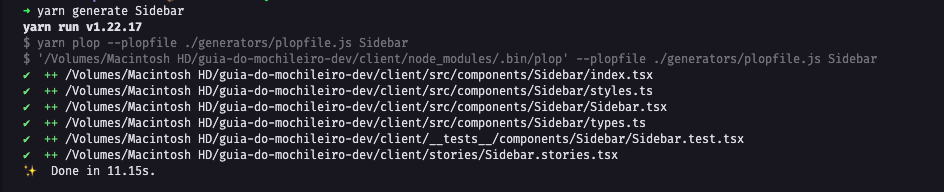
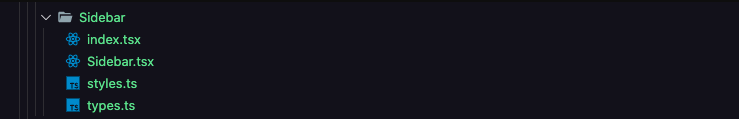

# Plopfile, o que é e como automatizar a criação de arquivos

Já pensou em criar vários arquivos de uma vez com apenas um comando? Sim, isso é possível utilizando o Plopfile. No meu dia-a-dia no trabalho sempre que eu precisava criar um componente novo no React eu tinha que pelo menos cinco arquivos diferente e todos seguiam o mesmo padrão, nomeDoComponente.tsx, index.tsx, styles.ts, types.ts. Então eu pensei, porque não automatizar essa tarefa, foi ai que eu encontrei essa lib para automatizar a criação de arquivos. Nela eu posso criar um template base para cada arquivo que eu quiser automatizar e sempre que eu executar o comando yarn generate `yarn generate NomeDoComponente` ele ira criar todos os arquivos com o nome que eu definir, como podem ver abaixo:

**Templates**


**Comando**



**Resultado**



## Primeiro adicione o Plop em seu projeto

```jsx
npm install —save-dev plop
yarn add plop -D
```

## Crie um arquivo com o nome **plopfile.js** no seu projeto

Eu gosto de cirar uma pasta chamada **generators** e dentro dessa pasta eu coloco o plopfile.js, mas você também pode criar direto na raiz do projeto.

```jsx
export default function (plop) {
  // gerador
  plop.setGenerator("controller", {
    description: "application controller logic", // descrição do gerador
    prompts: [
      {
        type: "input",
        name: "name",
        message: "controller name please",
      },
    ], // prompt é a pergunta que o gerador vai te fazer quando voce rodar o comando
    actions: [
      {
        type: "add", // com esse add ele vai adicionar um arquivo
        path: "src/{{name}}.js", // aqui é o path de onde o arquivo vai ser criado
        templateFile: "plop-templates/controller.hbs", // aqui é o arquivo que vai servir como base (o template)
      },
    ], // action é o que ele vai fazer quando voce responder o prompt
  });
}
```

### **Observações**

`export default`só é permitido no NodeJS dentro de arquivos suportados por "ESM". Para usar essa sintaxe, seu `plopfile` deve ser:

- Um arquivo .js ESM com o tipo: "module" no package.json
- Um arquivo .mjs ESM com qualquer tipo declarado no package.json

Outra alternativa é usa o  `plopfile` com o `module.exports = function (plop)` instanciado. Para essa sintaxe o `plopfile` deve ser:

- Um arquivo CommonJS .js com o tipo: "commonjs" no package.json

- Um arquivo CommonJS .cjs com qualquer tipo declarado no package.json

## Crie seus templates

Para a criação dos templates eu gosto de criar uma pasta dentro da pasta generators chamada templates.

Para criar o template voce deve usar o .hbs que é uma linguagem de templates, por exemplo:

component.tsx.hbs

```jsx
export const {{pascalCase name}} = () => {
  return (
    <div>
      <h1>{{pascalCase name}}</h1>
    </div>
  )
}
```

Esse {{pascalCase name}} serve para pegarmos o nome que passamos na hora do comando generate, o pascalCase é opcional voce também pode usar outros modifers conforme está na documentação que você pode ver clicando [aqui](https://plopjs.com/documentation/#case-modifiers).

Você pode criar o seu template da maneira que você preferir, acima é só um exemplo de como pode ser feito.

## Adicionando os templates nas actions

Para que o arquivo de template seja executado na action basta colocar no templateFile o caminho onde seu template está

```jsx
actions: [
  {
    type: "add", // com esse add ele vai adicionar um arquivo
    path: "src/{{name}}.js", // aqui é o path de onde o arquivo vai ser criado
    templateFile: "templates/component.tsx.hbs", // aqui é o arquivo que vai servir como base (o template)
  },
];
```

Você pode passar quantos arquivos quiser no actions, basta separa-los em objetos diferentes

```jsx
actions: [
  {
    type: "add",
    path: "src/{{name}}.js",
    templateFile: "templates/component.tsx.hbs",
  },
  {
    type: "add",
    path: "src/{{name}}/{{name}}.js", // você também pode criar pastas utilizando o name
    templateFile: "templates/index.tsx.hbs",
  },
];
```

Depois no `package.json` adicione na lista de scripts o script de generate com o caminho do seu plopfile.js

```jsx
"scripts": {
    "generate": "yarn plop --plopfile ./generators/plopfile.js"
  },
```

Assim todas as vezes que você rodar o comando yarn generate, ele ira criar os dois arquivos com o nome passado no comando e com a estrutura feita no template.
